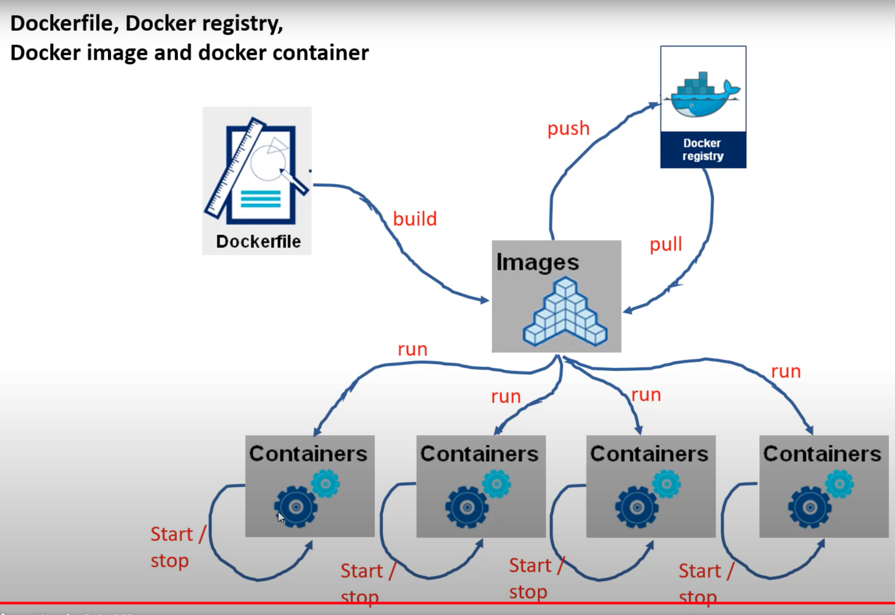

# learn_docker

Docker Image: docker image is a template that can be used to create a container or a bunch of containers. You can have many containers that are running and each container. You can start it or stop it.